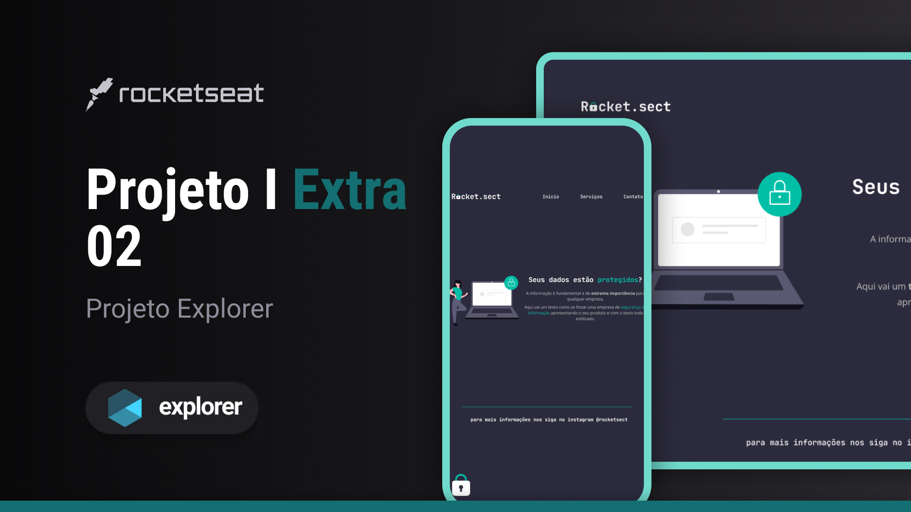

<h1 align="center"> 👨🏼‍💻Projeto-Extra-02 I Explorer 
  🚀👨🏼‍🚀#Desafios Rocketseat </h1>
 

  ⚠️ <strong>ATENÇÃO</strong> ⚠️
   
  Este é um projeto conceitual e não representa uma empresa ou serviço real.  
  Ele foi criado com o propósito de ser adicionado ao meu portfólio, demonstrando minhas habilidades e capacidades em projetos de design e desenvolvimento.  
  <a href="https://rocketforms.typeform.com/to/fPcSmBp9#referral_id=e8eb53b2-1777-4867-9b33-d468fc9d1422o">Estude projetos como este em formato de vídeo clicando aqui!</a>

  <a href="#-tecnologias">Tecnologias</a>&nbsp;&nbsp;&nbsp;|&nbsp;&nbsp;&nbsp;
  <a href="#-projeto">Projeto</a>&nbsp;&nbsp;&nbsp;|&nbsp;&nbsp;&nbsp;
  <a href="#-layout">Layout</a>&nbsp;&nbsp;&nbsp;|&nbsp;&nbsp;&nbsp;
  <a href="#memo-licença">Licença</a>

  

 

  

## 🚀 Tecnologias

Esse projeto foi desenvolvido com as seguintes tecnologias:

- HTML e CSS
- Git e Github
- Figma

## 💻 Projeto

O Projeto Extra 02 é um site básico com o intuito de divulgar uma empresa de Syber Security,oferecendo seus serviços/produtos.Este projeto possui três links principais:

- [Página inicial/principal do site da  Empresa](http://127.0.0.1:5500/index.html)

- [Página do site dedicada aos serviços](https://github.com/PabloPerdigao/Projeto-Extra-02-Explorer)

- [Página para contato](www.linkedin.com/in/pablo-perdigao)

## 🔖 Layout

Você pode visualizar o layout do projeto através [DESSE LINK](https://www.figma.com/file/lFLke2zqjp5ZDJZRC7zb1f/Explorer-(Copy)?type=design&node-id=0-1&mode=design&t=7E6Da2NCcOGbQK5I-0).   <strong>OBS:</strong> É necessário ter conta no [Figma](https://figma.com) para acessá-lo.

## 📝 Licença

Esse projeto está sob a licença MIT.

---

😉 Feito com ♥ by Pablo Perdigão, aluno Explorer da Rocketseat!  
📲 [Participe da comunidade Rocketseat!](https://discord.gg/rocketseat)
